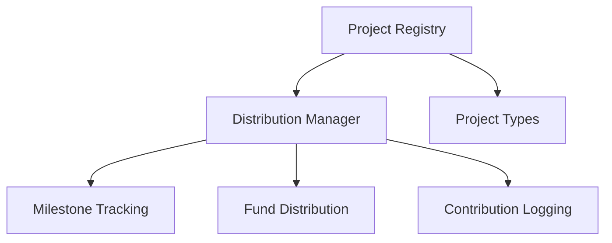

# Frontrun Distribute

A decentralized fund distribution platform built on the Stacks blockchain, enabling transparent and secure milestone-based project funding.

## Overview

Frontrun Distribute provides a comprehensive blockchain-native solution for managing project funding, tracking milestones, and ensuring fair compensation. The system offers:

- Project and participant registration
- Milestone-based fund distribution
- Transparent financial tracking
- Decentralized governance
- Flexible project type support
- Immutable activity logging

## Architecture

The system comprises two core smart contracts that manage project registration and fund distribution:



## Contract Documentation

### Project Registry (project-registry.clar)

Handles project registration, categorization, and basic metadata.

#### Key Features:
- Project type classification
- Creator-managed project registration
- Distribution contract binding
- Immutable project record

#### Project Types:
1. Corporate
2. Community
3. Open Source

### Distribution Manager (distribution-manager.clar)

Manages milestone completion, fund distribution, and financial tracking.

#### Key Features:
- Milestone-based fund release
- Contribution verification
- Transparent financial logging
- Decentralized governance mechanisms

## Getting Started

### Prerequisites
- Clarinet
- Stacks wallet
- Node.js environment

### Installation

1. Clone the repository
2. Install dependencies
```bash
clarinet install
```
3. Run tests
```bash
clarinet test
```

## Function Reference

### Project Registration

```clarity
(create-project 
  (name (string-utf8 100)) 
  (description (string-utf8 500))
  (project-type uint))
```

### Milestone Distribution

```clarity
(distribute-milestone-funds 
  (project-id uint)
  (milestone-id uint))
```

### Fund Management

```clarity
(set-distribution-contract 
  (project-id uint)
  (distribution-contract <distribution-manager-trait>))
```

## Development

### Testing

Run the test suite:
```bash
clarinet test
```

### Local Development

1. Start local chain:
```bash
clarinet integrate
```

2. Deploy contracts:
```bash
clarinet deploy
```

## Security Considerations

1. Role-based Access Control
    - Project creators manage distribution contracts
    - Transparent participant registration
    - Immutable project and milestone records

2. Financial Validation
    - Milestone-based fund release
    - Contribution verification mechanisms
    - Prevent unauthorized fund transfers

3. Governance Mechanisms
    - Decentralized project type support
    - Flexible distribution strategies
    - Transparent activity logging

4. Known Limitations
    - No retroactive fund modifications
    - Milestone completion requires external verification
    - Complex multi-party distributions may require custom implementations